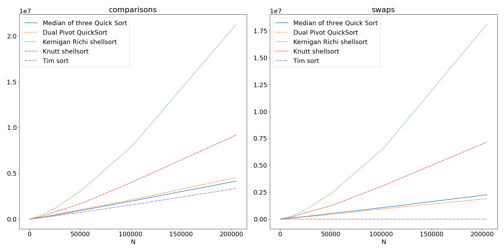
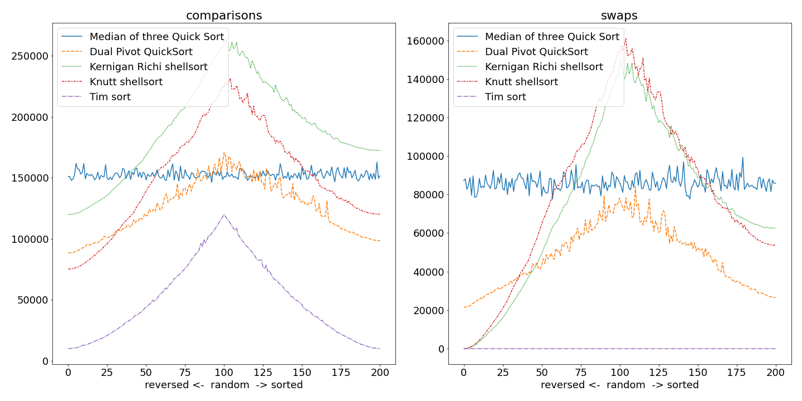

Методы сортировки располагаются по модулям.
- Метод `ShellSort` с последовательностями Кернигана-Ричи и Дональда Кнута реализован в [shellsort.py](./shellsort.py)
- Метод быстрой сортировки с двумя опорными элементами является переводом [реализации на Java](https://codeblab.com/wp-content/uploads/2009/09/DualPivotQuicksort.pdf) на python (файл [dualpivot.py](./dualpivot.py))
- Метод быстрой сортировки с медианой из трех случайных элементов в качестве опорного элемента заимствован [отсюда](https://stackoverflow.com/questions/50912873/python-quicksort-with-median-of-three) и располагается в модуле [quiksortmedian.py](./quiksortmedian.py) 

```
Некоторые из сортировок были измененны.

В названии файла quiksortmedian.py опечатка, но автору лень это исравлять. 
```


[counter.py](./counter.py) реализует класс `CountableFloat`, который подсчитывает количество сравнений и у которого доступен метод `being_swapped`.

[gen_data.py](./gent_data.py) генерирует стенд для испытаний, а [measure.py](./measure.py) прогоняет все описанные выше алгоритмы сортировки + `sorted` по этим данным и записывает количество сравнений и перестановок в файлы `csv`.

[measure_sizes.py](./measure_sizes.py) измеряет время сортировки случайнозаполненного массива в зависимости от размера этого массива.




